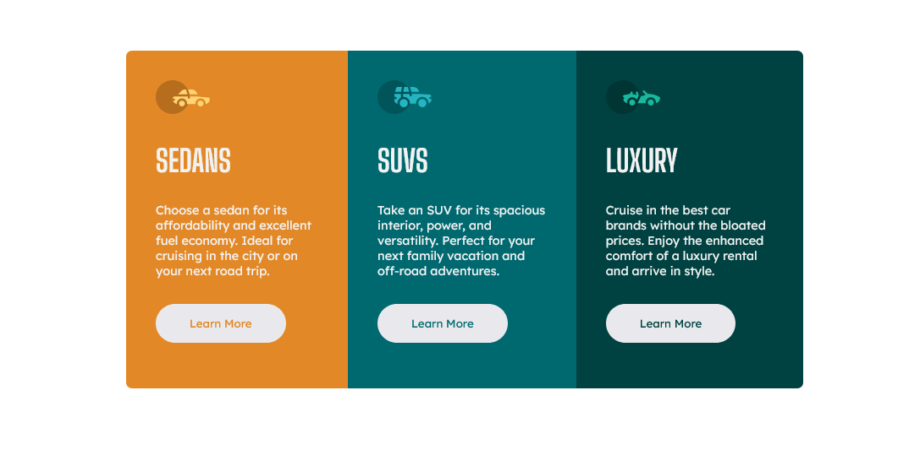
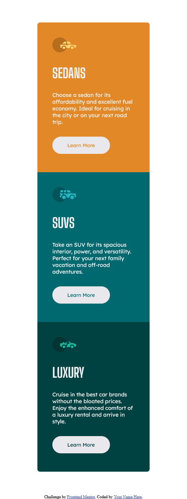

# Frontend Mentor - 3-column preview card

This is a solution to the [3-column preview card component challenge on Frontend Mentor](https://www.frontendmentor.io/challenges/3column-preview-card-component-pH92eAR2-). Frontend Mentor challenges help you improve your coding skills by building realistic projects. 

## Índice

- [Visão geral](#visão geral)
   - [O desafio](#o-desafio)
   - [Captura de tela](#captura-de-tela)
   - [Links](#links)
- [Meu processo](#meu-processo)
   - [Construído com](#construído-com)
   - [O que aprendi](#o-que-aprendi)
   - [Desenvolvimento contínuo](#desenvolvimento-contínuo)
   - [Recursos úteis](#useful-resources)
- [Autor](#autor)

## Visão geral

### O desafio

Os usuários devem ser capazes de:

- Veja o layout ideal para a interface, dependendo do tamanho da tela do dispositivo
- Veja os estados de foco e foco para todos os elementos interativos na página

### Captura de tela




### Links

- URL da solução: (https://github.com/felipe1590/product-preview)
- URL do site ao vivo: (https://felipe1590.github.io/product-preview/)

## Meu processo

### Construído com

- Marcação HTML5 semântica
- Propriedades personalizadas CSS
- Flexbox
- Fluxo de trabalho mobile first

### O que eu aprendi

```html
<div class="card">
  
  <h1 class="card-titulo">Sedans</h1>
  <p class="card-descricao">
    Choose a sedan for its affordability and excellent fuel economy. Ideal for cruising in the city
    or on your next road trip.
  </p>
  <button class="card-botao-sedans">Learn More</button>
</div>
```
Com um design diferente, esse projeto aborda a criação de cardes interativos que de alinham conforme o tamanho da tela, fazendo a separação em div que dâ maior dinâmica ao projeto. 

```css
 .card:nth-child(1) {
    background: var(--cor01);
    border-radius: 7px 7px 0 0;
}

.card:nth-child(2) {
    background: var(--cor02);
}

.card:nth-child(3) {
    background: var(--cor03);
    border-radius: 0 0 7px 7px;
}
```
Dessa forma como com poucas configurações de mudança, pude retrabalhar as mudança de cor e bordas arredondas conforme as divs filhas do painel principal.

### Desenvolvimento contínuo

Estou focando em aprender sobre layouts responsivos e como posso integrar isso ao JavaScript, desenvolvendo meus conhecimentos de maneira estruturada e focada no estudo aplicado do Front-end, depois de terminar todos os módulos do curso de Html e Css do Curso em Vídeo(https://www.cursoemvideo.com/) e partir para o básico de JavaScript. Estou enpenhado em produzir sites bonitos, mas semanticamente bem feitos, utilizando técnicas atualizadas de css, empregradas aos scripts simples.

### Recursos úteis

- [LANDING PAGE COM HTML e CSS!](https://www.youtube.com/watch?v=llF6vD-RljE&ab_channel=RafaellaBallerini) - Isso me ajudou simplesmente a entender como funciona o Flexbox e como o posicionamente pode ser usado em determinados momentos, integrando as técnicas mais tradionais de como montar uma página de manera responsiva. Eu realmente gostei desse padrão e vou usá-lo daqui para frente.
- [A Complete Guide to Flexbox](https://css-tricks.com/snippets/css/a-guide-to-flexbox/) - Este é um artigo incrível que me ajudou a finalmente entender mais a fundo como Flexbox ao mesmo tempo pode parecer complexo no começo, mas o treino e tempo mostram que essa inovação só tem a agregar na criação de sites de maneira mais descomplicada. Recomendo a todos que ainda estão aprendendo esse conceito.

## Autor

- Website - [Felipe Gama](https://felipe1590.github.io/portfolio/)
- Frontend Mentor - [@felipe1590](https://www.frontendmentor.io/profile/felipe1590)
- Linkedin - [Felipe Gama](https://www.linkedin.com/in/felipe-gama-3a5638265/)